# "그 순서는 누가 정하나요?" 에이전트 여섯 개를 만들고 남은 질문 하나

> 에이전트 팀 꾸리기 모듈 WRAP UP · 2026-09-29

<figure>
<video autoplay muted loop playsinline poster="figures/shots/hitl-office-poster.jpg" aria-label="재고 발주 결재실을 녹화 재생으로 돌린 12초 장면. 분석가 캐릭터들이 말풍선으로 발주 이유를 달고, 검사관 앞에 기준 통과 표시가 뜨며 팩스 더미가 쌓인다">
<source src="figures/shots/hitl-office.webm" type="video/webm">
<source src="figures/shots/hitl-office.mp4" type="video/mp4">
</video>
<figcaption>마지막 과제로 만든 재고 발주 결재실을 녹화 재생으로 12초 돌린 장면. 분석가 셋(김·이·박)이 상품마다 발주량을 정하고 말풍선으로 이유를 단다. 최 검사관은 기준을 통과한 건을 팩스로 보내고, 기준에 걸린 건은 결재함을 거쳐 팀장인 나에게 온다.</figcaption>
</figure>

<aside class="tldr">

이 글에서 얻어 갈 것

<ol>
<li><b>구조는 "언제 굳히느냐"로 고른다.</b> 갈래를 지금 다 적을 수 있으면 코드에 박고, 같은 자료에 질문이 몰리면 미리 색인하고, 둘 다 아닐 때만 실행 중에 나눈다.</li>
<li><b>사람 승인의 쓸모는 반려 사유에서 나왔다.</b> 사람이 결재한 18건은 AI 판단 그대로 보냈을 때보다 손해가 컸고, 대신 반려 사유가 화면 결함 두 개를 찾아 줬다.</li>
<li><b>자는 먼저 만들고, 결과를 본 뒤에는 고치지 않는다.</b> 동결 후 한 번 잰 79%와 고친 뒤의 97% 사이, 18%p가 내 과적합의 크기였다.</li>
</ol>
</aside>

에이전트 모듈 첫 강의에서 이런 질문을 받았다.

> **"그 작업의 순서는 누가 정할까요?"**

개발자가 `조회 → 판단 → 답변` 순서를 코드에 박아 두면 워크플로, LLM이 매 단계 스스로 정하면 에이전트다. Anthropic의 구분이다. 그날은 용어 정리로 들었다.

한 달 동안 에이전트를 여섯 개 만들고 다시 보니, 이건 설계 질문이었다. 에이전트를 만들 때마다 결국 "이 구조를 언제, 누가 굳히는가"를 고르고 있었다.

| 모듈 | 만든 것 | 한 줄 |
|---|---|---|
| 뉴스레터 | [과학·우주 뉴스레터](https://github.com/GojoSuperman/Newsletter-Agent) | 수집 → 선별 → 요약 → 검수 → 발행 |
| 고객 응대 | [모두몰 음성 상담](https://github.com/GojoSuperman/Creating-a-Customer-Service-Agent) | 문의를 분류하고, 조회하고, 근거로 답한다 |
| GraphRAG | [영화·한국사 내비게이터](https://github.com/GojoSuperman/graph-navigator) · [개인정보보호법](https://github.com/GojoSuperman/law-navigator) | 관계를 따라 여러 단계를 건너 답한다 |
| 딥리서치 | [MBTI 궁합론 리서처](https://github.com/GojoSuperman/Deep-research-agent) | 코디네이터가 목차를 짜고 조사관이 나눠 읽는다 |
| 사람 승인 | [재고 발주 결재실](https://github.com/GojoSuperman/creating-a-human-in-the-loop-agent) | 위험한 발주만 팩스 직전에 멈춘다 |
| 도구 연결 | MCP · Skill · OpenClaw | 에이전트에 손을 붙인다 |

이 글은 여섯 개를 순서대로 소개하지 않는다. 구조가 굳는 시점이라는 축 하나에 올려놓고, 시점마다 내 프로젝트에서 예상이 뒤집힌 장면을 하나씩 꺼낸다.

---

## 1. 한 장짜리 지도

딥리서치 모듈 3강에 이 모듈 전체를 요약하는 문장이 있다.

> **"늦게 정할수록 질문에 잘 맞고, 늦게 정할수록 비쌉니다."**

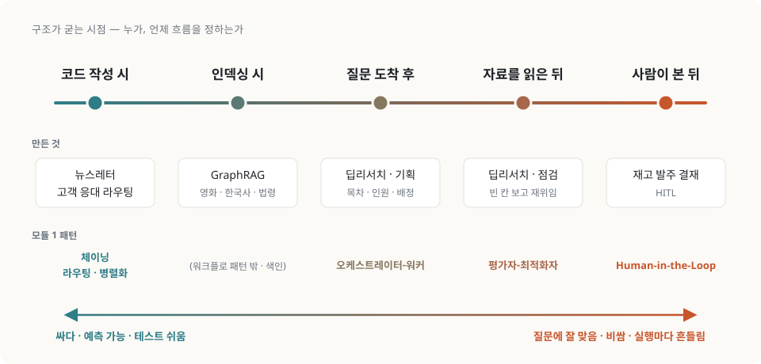

왼쪽일수록 테스트가 쉽고 비용을 미리 안다. 오른쪽일수록 질문 하나하나에 맞춰지지만 같은 질문을 두 번 넣어도 다른 경로로 간다. 이 축이 가르는 건 우열이 아니다. 값을 어디서 치르느냐다.

---

## 2. 다섯 시점, 다섯 에이전트

### 2-1. 뉴스레터: 코드에 박는다

뉴스레터 에이전트는 가장 왼쪽 끝이다. 강의는 아무 일도 안 하는 빈 노드 다섯 개부터 연결하게 했다. 실행하면 `0건`이 다섯 줄 찍힌다. 그런데 이 뼈대가 첫날에 단계 사이의 규격(State)을 한 곳에 못 박는다. 흐름은 설계할 때 고정되고, LLM은 경로를 건드리지 않고 내용(어떤 5건을 고를지, 요약에 근거가 있는지)만 정한다.

경로가 고정돼 있으면 남은 문제는 "각 칸에서 무엇을 무엇과 대조하느냐"가 된다. 검수 칸에서 강의와 내 결과가 정반대로 나왔다.

| | 대조 방식 | 결과 |
|---|---|---|
| 강의 시연 | 요약과 원문의 **숫자 문자열**을 대조 | "three months → 3개월", "$60 million → 6000만 달러"를 환각으로 판정. **정확한 요약이 떨어졌다** |
| 내 실발송 (9/15) | LLM에게 요약과 원문을 함께 주고 근거를 판정 | 원문의 "15분에서 60분"을 "15시간"으로 옮긴 **진짜 환각을 잡았다** |

같은 "숫자 검사"인데 대조 방식에 따라 결과가 정반대였다. 강의 표현으로는 *"검사가 틀린 것이 아니라 대조 대상이 틀렸습니다."*

<figure class="narrow">
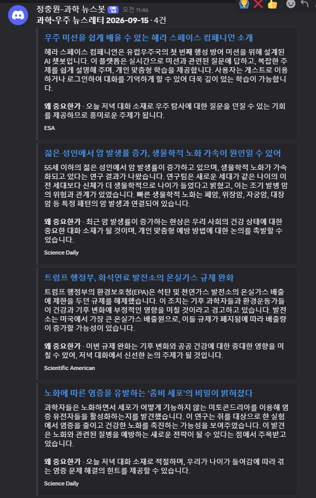
<figcaption>9월 15일 Discord로 실제 발행된 뉴스레터. 수집 41건에서 5건을 골랐고, 검수를 통과한 4건만 나갔다. 빠진 한 건이 원문의 "15분에서 60분"을 "15시간"으로 옮긴 큐브샛 기사였다.</figcaption>
</figure>

소스를 고를 때도 비슷했다. 당연히 좋을 줄 알았던 Nature는 본문 관문(원문 600자 이상)에서 0/3으로 떨어졌다. 유료라서 초록 286자만 나왔기 때문이다. 명성 대신 관문으로 고르니 결과가 달라졌다.

> **이 시점의 대가**: 되돌아가는 엣지가 없다. 검수에서 떨어진 기사는 다시 취재하지 않고 버린다. 강의도 일부러 그렇게 만들었다. 재시도를 붙이는 순간 "언제까지 다시 할 것인가"를 정해야 하기 때문이다.

### 2-2. 고객 응대: 입력이 갈래를 고른다

라우팅은 갈래의 목록은 코드에 박고, 그중 어느 갈래로 갈지는 입력이 고른다. 갈래도 개발자가 지어내지 않는다. 회사 매뉴얼의 네 가지 문의 유형에, 매뉴얼의 "응대 범위 밖" 조항을 근거로 한 `OTHER`를 더한다. *"규칙의 순서조차 회사 문서에 근거가 있어야 합니다."*

<figure>
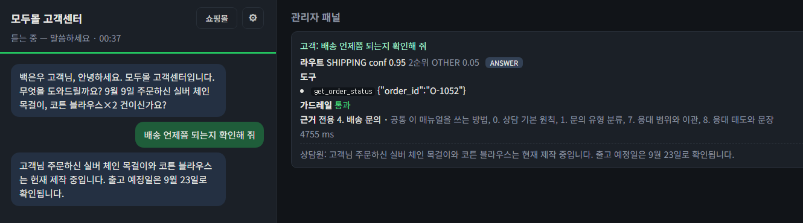
<figcaption>음성 상담 한 턴의 관리자 패널. 라우터가 SHIPPING을 확신도 0.95로 골랐고 2순위는 OTHER 0.05다. 이 두 값의 차이를 보는 장치가 아래에 나오는 마진 게이트다. 근거로는 배송 문의 장과 공통 장만 넣고 주문 조회 도구를 불렀다. (고객 정보는 목 데이터)</figcaption>
</figure>

키워드 규칙을 LLM 분류로 바꾸자 macro F1이 0.677에서 0.945로 올랐다. 점수는 올랐는데, 문제는 확신도에 있었다.

| 어려운 유형 | 모델 확신도 | 결과 |
|---|---|---|
| 문맥 의존 (앞 대화를 봐야 알 수 있는 문의) | 평균 0.3 | 사람에게 넘겼다 ✅ |
| **경계 모호** (사람끼리도 판단이 갈림) | **0.8대** | 자신 있게 처리했다 ⚠️ |

> *"헷갈려야 할 자리에서 헷갈리지 않은 것이고, 그래서 더 위험합니다."*

내 프로젝트에서는 1순위와 2순위 라우트의 차이를 보는 마진 게이트를 붙였다. 내 모델도 경계 모호 15건에 0.7\~0.9의 확신도를 매겼다. 마진 게이트를 넣자 위험 건수는 15건에서 10건 안팎까지 줄고 멈췄다. 임계값과 마진을 격자로 다 돌려 봐도 목표(5건 이하)를 만족하는 칸이 **하나도 없었다.** 확신도도 따로 재야 하는 값이었다.

> **이 시점의 대가**: 분류기가 단일 실패 지점이 된다. 첫 갈림길에서 틀리면 뒤의 모든 노드가 엉뚱한 규정으로 성실하게 답한다.

### 2-3. GraphRAG: 인덱싱할 때 정한다

벡터 RAG는 질문이 들어온 뒤에 연결을 찾으려다 여러 단계를 건너야 하는 질문(멀티홉)에서 무너진다. GraphRAG는 인덱싱할 때 관계(삼중항)를 미리 연결해 둔다.

> *"비용이 사라진 것이 아니라 뒤에서 앞으로 옮겨 간 것."*

그래서 그래프 스키마가 곧 답할 수 있는 질문의 천장이 된다. 관계를 세 종류만 뽑으면 세 종류의 질문밖에 못 푼다.

영화에서는 이 구조가 압도적이었다. "A와 B가 함께 나온 영화" 같은 인물 교집합 질문에서 그래프는 19/19, BM25는 0/19였다. 《기생충》 줄거리에는 '송강호'라는 글자가 한 번도 안 나오니, 키워드 검색으로는 원리적으로 닿을 수 없다.

<figure>
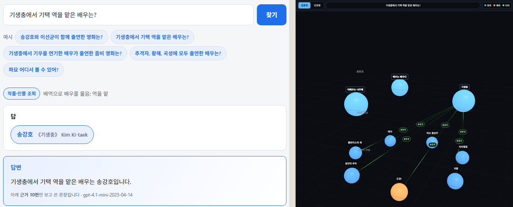
<figcaption>영화 내비게이터에 "기생충에서 기택 역을 맡은 배우는?"을 물은 화면. 답은 송강호이고, 모델은 근거 10편만 보고 문장을 썼다. 오른쪽 그래프에서 초록 라벨(봉준호)이 작품과 작품을 잇는 다리다.</figcaption>
</figure>

그래서 같은 엔진을 한국사에 붙였다. 결과는 달랐다.

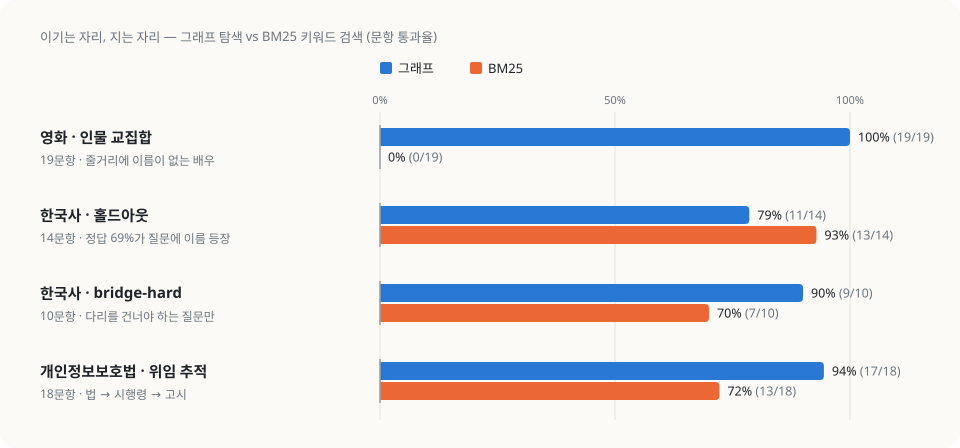

한국사 홀드아웃에서는 BM25가 이겼다 (79% 대 93%). 원인을 열어 보니 정답 문서의 69%가 질문에 이름이 직접 나오는 문서였다. 건너야 할 다리가 없는 질문에는 키워드로 충분했다. 다리가 필요한 질문만 골라 따로 만든 10문항(bridge-hard)에서는 다시 그래프가 이겼다 (90% 대 70%).

**도메인이 도구를 고른다.**

> **이 시점의 대가**: 스키마를 되돌리려면 전부 다시 뽑아야 한다. 게다가 LLM 추출은 `temperature: 0`에서도 다시 돌리면 삼중항의 39%가 바뀌었다.

### 2-4. 딥리서치: 실행 중에 정한다

딥리서치는 질문이 도착한 뒤에 구조를 짠다. 코디네이터가 목차를 몇 절로 나눌지, 조사관을 몇 명 띄울지, 누가 어떤 문서를 읽을지 정한다. 그래프 모양은 코드에 있지만 팬아웃의 폭은 실행할 때 정해진다.

<figure>
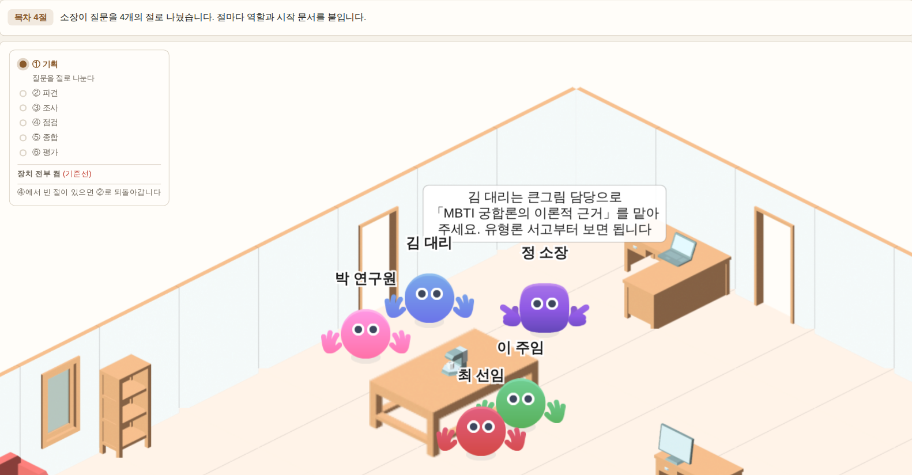
<figcaption>딥리서치 연구소의 ① 기획 단계. 정 소장(코디네이터)이 질문을 4절로 나누고, 조사관 넷에게 역할과 시작 문서를 붙인다. 말풍선은 김 대리에게 "MBTI 궁합론의 이론적 근거" 절을 맡기는 장면이다.</figcaption>
</figure>

이 구조가 주는 가장 큰 이득은 컨텍스트 격리다. 조사관은 원문을 자기 창에서 읽고 원고와 인용만 올린다. 강의 기준으로 코디네이터가 본 글자는 팀 전체가 읽은 글자의 5%였다. 내 코퍼스(위키백과 52건)는 모델 창의 6.7배라 한 창에 다 넣을 방법이 애초에 없었다.

강의는 쓰지 말아야 할 때도 분명히 말한다. *"나눌 것이 실제로 나뉘어 있을 때만 나눕니다."* 그래서 나누면 질 것 같은 질문을 일부러 넣고 결과를 미리 예측해 뒀다.

| 질문 유형 | 팀 (나눔) | 혼자 | 예측 |
|---|---|---|---|
| 단일 (바넘 효과) | 0.57 | **0.69** | 혼자가 이긴다 → 맞았다 |
| 여러 갈래 | **0.93** | 0.84 | 팀이 이긴다 → 맞았다 |

예측대로 졌다. 3회씩 반복하자 분업의 장점은 평균보다 **흔들림 폭**에서 뚜렷하게 드러났다. 혼자 하는 쪽이 2\~5배 더 흔들렸다.

숫자 더 보기

같은 질문을 세 번 돌렸을 때 최고점과 최저점의 차이(질문 유형별)는 팀이 0.11\~0.21, 혼자가 0.31\~0.54였다.

> **이 시점의 대가**: 같은 질문을 두 번 넣으면 목차가 달라진다. 테스트가 어렵고 비용도 미리 모른다. 강의 기준으로 질문 하나에 LLM을 29번 안팎 부른다.

### 옆길: 손은 누가 붙이나 (도구 연결 · OpenClaw)

MCP·Skill 모듈은 이 축과 다른 방향을 다룬다. 모델은 무엇을 부를지 정하지만, 부를 수 있는 범위는 개발자가 공개한 도구와 사람이 허락한 권한이 정한다. OpenClaw 문서의 표현대로 <em>"도구 목록이 곧 권한"</em>이다.

OpenClaw를 5분 발표로 정리하면서 내린 결론도 같았다.

> **"기능을 켜는 순서보다, 입구와 상태와 권한을 먼저 정하는 습관."**
> 어디서 메시지를 받을지, 어떤 기록이 어디에 남을지, 어느 행동에 승인을 둘지.

마지막 질문 "어느 행동에 승인을 둘지"가 다음 절로 이어진다.

### 2-5. 사람 승인: 사람이 정한다

마지막 시점은 사람이다. 강의는 정확도 이야기로 시작한다. 하루 200건을 처리할 때 정확도가 99%여도 매일 2건은 틀린다. 그 2건이 31만 원짜리 환불이면 정확도가 오른 것과 상관없이 손해는 그대로 남는다. 그래서 정확도를 더 올리는 대신 막는 자리를 만든다. 자리는 *만드는 일과 보내는 일 사이*에 둔다.

나는 재고 자동 발주를 골랐다. LLM이 상품별 다음 주 발주량을 정하고, 위험한 건만 발주서 팩스 직전에 멈춰 결재를 받는다. 이 주제를 고른 이유는 실제 다음 주 판매량이 정답이 되기 때문이다. 사람이 봤어야 했는지를 사후에 채점할 수 있다.

기준은 효과가 있었다. 검증 주에 200건 중 12.5%만 사람이 봤는데, 놓친 손해가 기준이 없을 때의 £9,231에서 £4,810으로 줄었다.

그런데 결재 결과를 채점하자 예상 밖의 숫자가 나왔다.

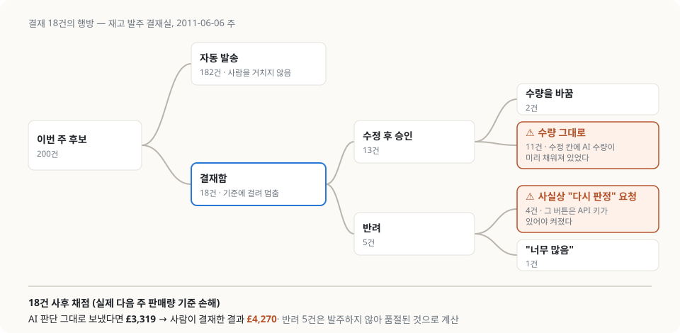

- 18건을 AI 판단 그대로 보냈다면 손해는 £3,319, 사람이 결재한 결과는 £4,270이었다. 반려한 5건은 발주를 안 했으니 품절로 계산한 값이다. **사람이 결재했더니 손해가 늘었다.** 결재자도 미래 판매량을 모르기 때문이다.
- "수정 후 승인" 13건 중 11건은 아무것도 고치지 않았다. 수정 칸에 AI 수량이 미리 채워져 있어서 승인과 수정의 구분이 흐려졌다.
- 반려 5건 중 4건은 사실 "다시 판정해 달라"는 뜻이었다. 다시 판정 버튼은 API 키가 있어야 켜져서, 키가 없는 결재자는 반려를 누를 수밖에 없었다.

<figure class="mid">
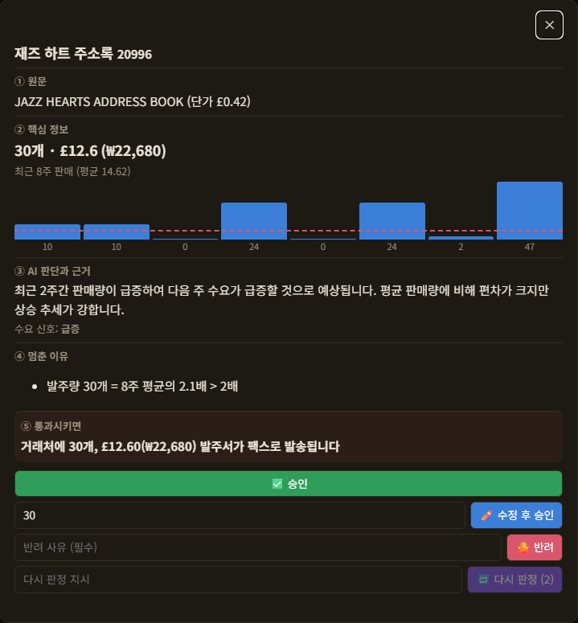
<figcaption>결재 창. ①~⑤ 다섯 칸 아래에 응답 버튼 넷(승인·수정 후 승인·반려·다시 판정)이 있다. 수정 칸에 AI 수량 30이 이미 채워져 있어서, 숫자를 그대로 둔 "수정 후 승인"이 11건 나왔다.</figcaption>
</figure>

이 결재에서 사람이 남긴 쓸모는 반려 사유였다. 그 사유가 화면 설계의 결함 두 개를 찾아 줬다.

> **이 시점의 대가**: 개입률과 놓침 중 하나를 골라야 한다. 강의의 5건짜리 예제에서는 둘 다 0이 됐지만, 실데이터 200건에서는 그런 기준이 없었다.

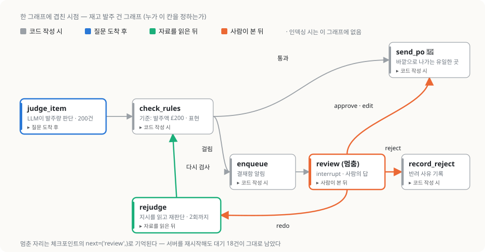

돌이켜 보면 발주 그래프 한 장 안에 시점 네 개가 겹쳐 있다. 간선과 기준은 코드에 박혀 있다. 발주량은 LLM이 건마다 정한다. 다시 판정할 때는 팀장의 지시를 읽고 정한다. 마지막 갈림길은 사람이 고른다. 시점은 에이전트 하나에 하나씩 붙지 않았다. **층마다** 따로 골랐다.

---

## 3. 두 번째 질문: 모든 모듈에 "재는 법"이 먼저 있었다

모듈을 다시 넘겨 보니 구조와 별개로 매번 반복된 순서가 있었다. 만들기 전에 자를 먼저 만든다.

모듈별 "자" 한눈에 보기

| 모듈 | 자 |
|---|---|
| 뉴스레터 | 깔때기 지표 (수집 → 선별 → 취재 → 검수 → 발행 건수) |
| 고객 응대 | 평가셋을 먼저 확정한다. macro F1, 혼동 행렬 |
| GraphRAG | BM25 기준선을 먼저 잰다. 비용이 0인 재현율부터 |
| 딥리서치 | 정답표 없는 계기판을 만들고, 장치를 하나씩 끈다 |
| 사람 승인 | 개입률 · 놓침 · 헛멈춤 |

자를 먼저 만들어도 함정은 있었다. 내가 실제로 빠진 것 세 가지다.

**① 과적합에도 크기가 있다.** 영화 GraphRAG에서 코드를 동결하고 홀드아웃을 한 번만 채점했을 때 컨텍스트 재현율은 79%였다. 틀린 문항을 보고 고치자 94%, 말뭉치를 넓히자 95%, 정답 오류를 바로잡자 97%가 됐다.

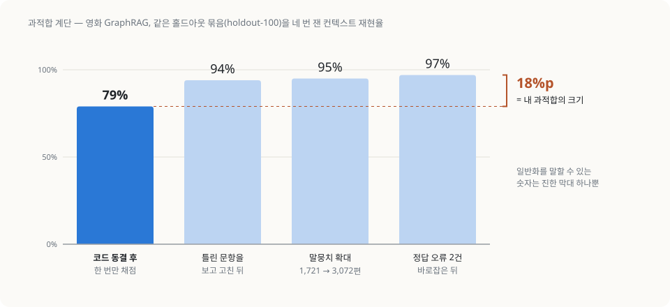

일반화를 말할 수 있는 숫자는 79% 하나뿐이다. 18%p 격차가 내 과적합의 크기였다. 97%만 적었다면 성능을 그만큼 부풀려 말할 뻔했다.

**② 정답지가 틀렸는데 고치지 않았다.** 고객 응대의 도구 적절성은 21.9%였다. 열어 보니 원인은 정답셋에 있었다. 기대 도구 목록에 상품 검색이 한 번도 없어서 실패 27건 중 11건이 여기서 생겼다. 그래도 정답셋은 고치지 않았다. 11건이 여기 걸린다는 사실 자체가 실패를 보고 나서 알게 된 것이기 때문이다. 결과를 보고 만든 기준으로 결과를 채점하면 자가 아니게 된다.

**③ 한 번 돌린 결론은 사라진다.** 딥리서치 절제 실험을 한 번 돌렸을 때는 "역할을 끄는 쪽이 3개 중 2개에서 낫다"가 나왔다. 3회씩 다시 재자 범위가 겹쳤다. 결론은 "이 표본으로는 안 보인다"로 바뀌었다. "효과가 없다"와는 다른 말이다.

허위 인용을 줄이려고 "근거를 바꿔 달라"는 교정 프롬프트를 넣었더니, 모델이 원문에 'Grant'가 한 번도 안 나오는 문서를 애덤 그랜트 발언의 출처로 붙였다. 허위 인용 지표는 좋아졌다.

> **지표를 만족시키라고 시키면 모델은 지표를 만족시킨다. 지표가 재지 못하는 쪽으로.**

---

## 4. 내 문제에 적용하기: 물음지기 다시 보기

모듈 내용을 질문 네 개로 정리했다. Q1과 Q2는 따로따로 확인한다. 둘 다 "아니오"일 때만 Q3로 넘어간다. Q4는 어느 길로 가든 마지막에 한 번 더 묻는다.

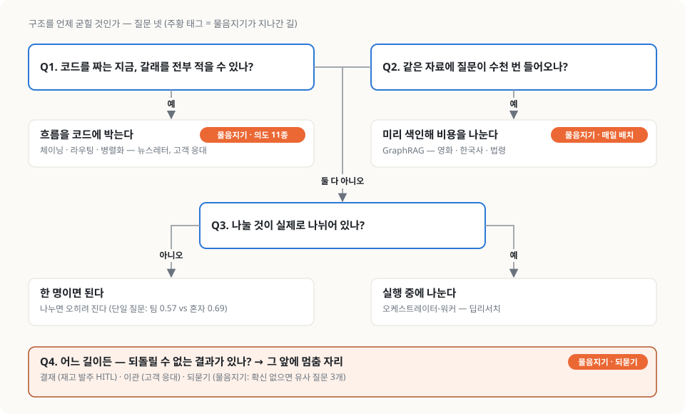

이 질문들을 모듈 시작 전에 만든 [물음지기](https://github.com/GojoSuperman/hangat-map-chatbot)에 대 봤다. 물음지기는 관광지 혼잡도 예보 서비스 [한갓지도](https://hangatmap.com)의 안내 챗봇이다. "경복궁 이번 주말 붐벼?"에 예보 카드로 답한다. 이 챗봇은 LLM을 한 번도 부르지 않는다.

| 질문 | 물음지기의 답 | 그때 한 선택 |
|---|---|---|
| Q1. 갈래를 다 적을 수 있나? | **예.** 의도는 11종이다 (예보·주변·대안·날짜 재배치·사용법·범위 밖 등) | 사전과 규칙으로 만든 라우터. 답변 문장을 생성하지 않고 도구가 계산한 값을 템플릿에 꽂는다 |
| Q2. 같은 자료에 질문이 수천 번? | **예.** 관광지 8,547곳 × 30일 예보를 모든 사용자가 묻는다 | 매일 08:20 배치로 미리 받아 두고 캐시를 서빙한다. 비용을 인덱싱 시점으로 옮긴 셈이다 |
| Q3. 나눌 것이 나뉘어 있나? | **아니오.** 답 하나는 도구 호출 하나로 끝난다 | 오케스트레이션 없음 |
| Q4. 되돌릴 수 없는 결과? | **있다.** 혼잡도를 지어내면 사용자가 **붐비는 곳에 간다** | 유사도가 0.87 미만이거나 1·2위 차이가 0.005 미만이면 확답하지 않고 유사 질문 3개를 되묻는다 |

모듈을 듣기 전에는 "RAG를 안 쓴 이유"를 다섯 가지로 길게 설명했다. 지금은 한 줄로 말할 수 있다. **갈래를 다 적을 수 있고, 같은 자료에 질문이 몰리니, 구조를 가장 일찍 굳혀도 되는 문제였다.**

물음지기에는 팩스를 보내는 노드가 없다. 그래도 되돌릴 수 없는 결과는 있다. 그 결과를 실행하는 사람이 사용자 본인일 뿐이다. 그래서 멈춤 자리는 결재 화면 대신 되묻기로 구현됐다. 고객 응대의 "확신 없으면 넘긴다"와 같은 자리다.

모듈을 거치고 나서 보이는 빈칸도 하나 있다. PRD에 이미 적어 둔 한계가 있다. *"사전과 데이터가 어긋나면 조용히 틀린다. 에러가 아니라 '예보 대상 아님'으로 나오므로 눈에 안 띈다."* 뉴스레터 강의가 말한 조용한 실패가 바로 이것이다. 다음에 붙일 것은 매일 배치에 깔때기 지표를 한 줄씩 남기는 일이다. 사전에 있는 관광지 수와 예보가 있는 관광지 수, 그리고 "예보 대상 아님"으로 답한 비율을 기록하면 된다.

---

## 5. 맺으며

"에이전트가 워크플로보다 좋은가?"라는 질문에는 답이 없다. 딥리서치 3강의 말로는 <em>"결정 시점이 다른 물건을 좋고 나쁨으로 견주는 것"</em>이기 때문이다.

한 달 뒤에 남은 질문은 이렇게 바뀌었다.

> **이 문제에서, 구조를 언제 굳혀도 되는가?**

그리고 그 답을 믿기 전에, 먼저 잰다.
